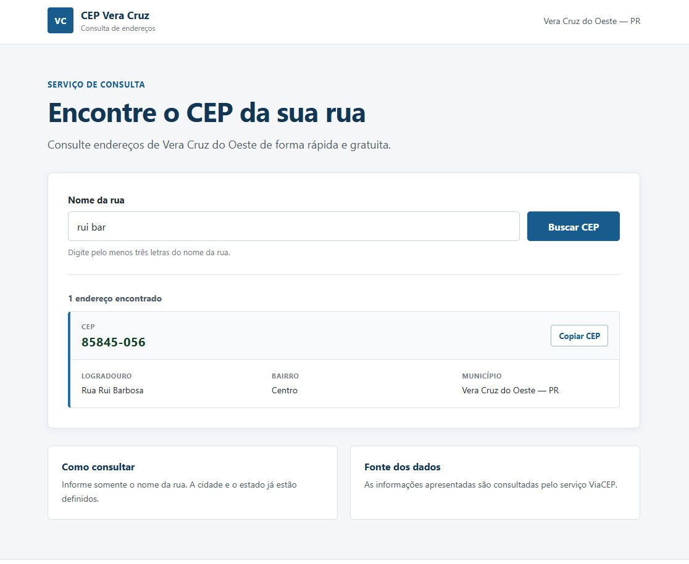

# Buscador de CEP

Aplicação full-stack desenvolvida para pesquisar CEPs pelo nome das ruas de Vera Cruz do Oeste, Paraná.

## Demonstração



## Acessar o projeto

- Site: https://codelian2311.github.io/buscador-cep/
- API: https://buscador-cep-api.onrender.com

## Funcionalidades

- Pesquisa pelo nome da rua
- Consulta de dados reais pelo ViaCEP
- Exibição do CEP
- Exibição do logradouro
- Exibição do bairro
- Exibição da cidade e do estado
- Validação de pesquisas muito curtas
- Mensagem para ruas não encontradas
- Interface adaptada para celulares

## Tecnologias utilizadas

### Front-end

- HTML
- CSS
- JavaScript

### Back-end

- Java
- Spring Boot
- Maven
- API REST

### Serviços

- ViaCEP
- GitHub
- GitHub Pages
- Render
- Docker

## Como o sistema funciona

1. A pessoa digita o nome da rua.
2. O JavaScript envia a pesquisa para o back-end.
3. O back-end desenvolvido em Java consulta o ViaCEP.
4. O ViaCEP devolve os endereços encontrados.
5. O resultado aparece na página.

## Estrutura do projeto

```text
buscador-cep
├── backend
│   ├── src
│   ├── Dockerfile
│   ├── pom.xml
│   ├── mvnw
│   └── mvnw.cmd
│
├── docs
│   ├── index.html
│   ├── style.css
│   └── script.js
│
├── .gitignore
└── README.md
```

## Executar o back-end localmente

É necessário ter o Java instalado.

Entre na pasta do back-end:

```bash
cd backend
```

No Windows:

```bash
mvnw.cmd spring-boot:run
```

Em Linux ou macOS:

```bash
./mvnw spring-boot:run
```

A API ficará disponível em:

```text
http://localhost:8080
```

Rota de teste:

```text
http://localhost:8080/api/teste
```

Exemplo de pesquisa:

```text
http://localhost:8080/api/cep?rua=Rui%20Barbosa
```

## Executar o front-end localmente

Abra o arquivo:

```text
docs/index.html
```

Também é possível usar a extensão Live Server no VS Code.

## Observação

O back-end utiliza uma hospedagem gratuita. Por isso, a primeira pesquisa pode demorar enquanto o servidor é iniciado.

## Autor

Desenvolvido por [CodeLian](https://github.com/codelian2311).
